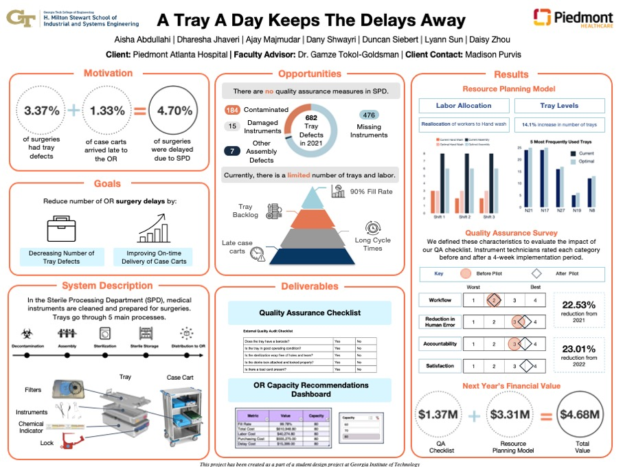

# Senior Design Capstone Project

Semester long capstone project with Piedmont Hospital in Atlanta to optimize the allocation of labor and instruments to prevent surgery delays. This saved the hospital $4.68 million and increased surgery fill rate by 10%.

We were able to successfully find the optimal level of trays and labor allocation at various stations in order to maximize the hosptial fill rate for the neurosurgery service line and for various hosptial capacities due to COVID. We accomplihsed this via a simulation model built in Simio and performed the optimizations with OptQuest. 

Please view the project final report and poster linked in the files above to gain a deeper understanding! 

